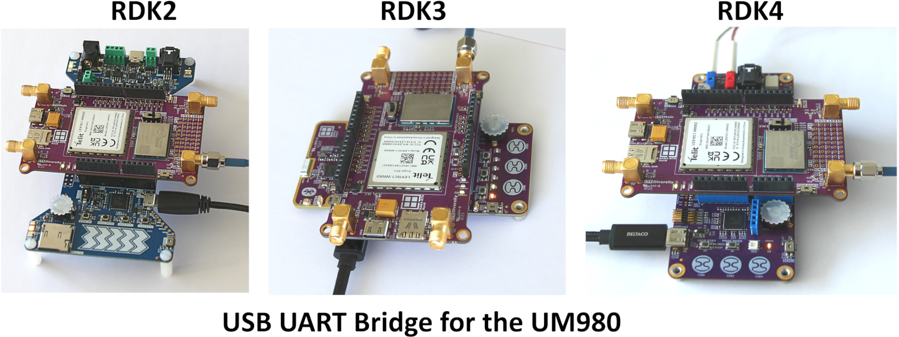

# USB UART for UM980 RTK GNSS

This is a universal code example that enables the UM980 to communicate with a host PC over the USB. The Rutronik Development Kits [RDK2](https://github.com/RutronikSystemSolutions/RDK2_Documents), [RDK3](https://github.com/RutronikSystemSolutions/RDK3_Documents), or [RDK4](https://github.com/RutronikSystemSolutions/RDK4_Documents) may be used for this purpose together with the Rutronik Adapter Board the [RAB4-RTK](https://github.com/RutronikSystemSolutions/RAB_RTK_Hardware_Files), and [UPrecise](https://en.unicorecomm.com/download?id=4#tab) software provided by Unicore Communications Inc.

This particular code example is optimized to work with the **RDK4** platform. Since it acts as a USB UART Bridge, any software on a host side can be used to read the measurements or send the commands to any device that is interfaced with Arduino UART and communicates at 115200 bit/s of baud rate.

 


## Requirements

- [ModusToolbox® software](https://www.infineon.com/cms/en/design-support/tools/sdk/modustoolbox-software/) v2025.4.0
- The RDK3 development kit must be provisioned before use.
- The RDK4 development kit must be powered from BATTERY terminals with a 12V power supply.

## Supported toolchains (make variable 'TOOLCHAIN')

- GNU Arm&reg; Embedded Compiler v11.3.1 (`GCC_ARM`) - Default value of `TOOLCHAIN`

## Using the code example

Create the project and open it using one of the following:

<details><summary><b>The Eclipse IDE for ModusToolbox&trade; software</b></summary>


1. Click the **New Application** link in the **Quick Panel** (or, use **File** > **New** > **ModusToolbox&trade; Application**). This launches the [Project Creator](https://www.infineon.com/ModusToolboxProjectCreator) tool.

2. Pick a kit supported by the code example from the list shown in the **Project Creator - Choose Board Support Package (BSP)** dialog.

   When you select a supported kit, the example is reconfigured automatically to work with the kit. To work with a different supported kit later, use the [Library Manager](https://www.infineon.com/ModusToolboxLibraryManager) to choose the BSP for the supported kit. You can use the Library Manager to select or update the BSP and firmware libraries used in this application. To access the Library Manager, click the link from the **Quick Panel**.

   You can also just start the application creation process again and select a different kit.

   If you want to use the application for a kit not listed here, you may need to update the source files. If the kit does not have the required resources, the application may not work.

3. In the **Project Creator - Select Application** dialog, choose the example by enabling the checkbox.

4. (Optional) Change the suggested **New Application Name**.

5. The **Application(s) Root Path** defaults to the Eclipse workspace which is usually the desired location for the application. If you want to store the application in a different location, you can change the *Application(s) Root Path* value. Applications that share libraries should be in the same root path.

6. Click **Create** to complete the application creation process.

For more details, see the [Eclipse IDE for ModusToolbox&trade; software user guide](https://www.infineon.com/MTBEclipseIDEUserGuide) (locally available at *{ModusToolbox&trade; software install directory}/docs_{version}/mt_ide_user_guide.pdf*).

</details>

### Operation

- Mount the RAB4-RTK Adapter Board on your RDK.

- Please do not forget to connect the 2J7C01MC3F or 2J7C01MC2F antenna to the GNSS UM980 port P7.

- Connect the PC to your RDK’s USB KitProg3 terminal.

- Programm the firmware.

- Load the UPrecise software.

  All the new UM980 modules do not send any NMEA information to the UART interface by default. To enable the NMEA sentences please send the commands as shown below:

  ```
  GNGGA 1
  GNRMC 1
  GNGSV 1
  GNGSA 1
  SAVECONFIG      %If you need to save the current commands configuration.
  ```

For the typical precision of GNSS measurements, the commands shown above are fully sufficient.


#### SBC Development Mode

A special mode, called SBC Development Mode, is available during software development or debugging of the system. The watchdog counter is stopped and does not need to be triggered. This mode can be accessed by setting the TEST [**FO3**] pin to GND during SBC Init Mode.

## Legal Disclaimer

The evaluation board including the software is for testing purposes only and, because it has limited functions and limited resilience, is not suitable for permanent use under real conditions. If the evaluation board is nevertheless used under real conditions, this is done at one’s responsibility; any liability of Rutronik is insofar excluded. 


